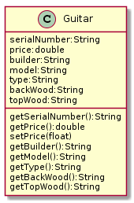
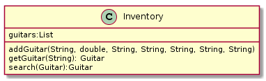
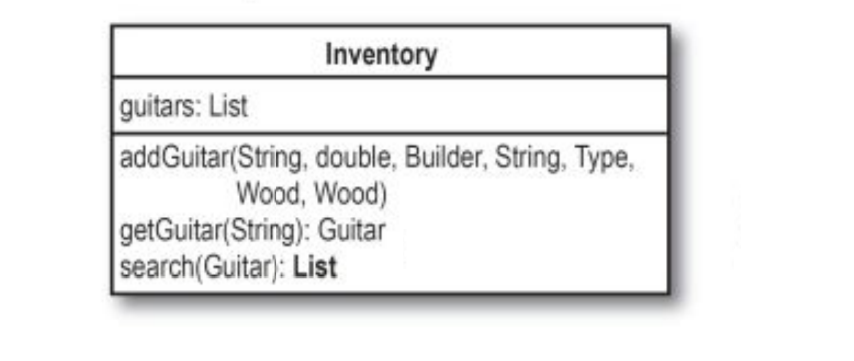

# 1장 (1)

## 릭의 새 프로그램

UML 클래스 다이어그램을 통해서 프로그램 회사가 프로그램을 만들어 주었다.







```javascript
class Guitar {
  constructor(serialNumber, price, builder, model, type, backWood, topWood) {
    this._serialNumber = serialNumber;
    this._price = price;
    this._builder = builder;
    this._model = model;
    this._type = type;
    this._backWood = backWood;
    this._topWood = topWood;
  }
  getSerialNumber() { return this._serialNumber; }
  getPrice() { return this._price; }
  setPrice(price) { this._price = price; }
  getBuilder() { return this._builder; }
  getModel() { return this._model; }
  getType() { return this._type; }
  getBackWood() { return this._backWood; }
  getTopWood() { return this._topWood; }
}

class Inventory {
  constructor() {
    this.guitars = new LinkedList();
  }
  addGuitar(serialNumber, price, builder, model, type, backWood, topWood) {
    const guitar = new Guitar(serialNumber, price, builder, model, type, backWood, topWood);
    this.guitars.add(guitar);
  }
  getGuitar(serialNumber) {
    const k = this.guitars.iterator();
    for(let i = k.next(); !i.done; i = k.next()) {
      if(i.value.getSerialNumber() === serialNumber) {
        return i.value;
      }
    }
    return null;
  }
  search(searchGuitar) {
    const k = this.guitars.iterator();
    // 일련번호와 가격은 유일한 값이니까 무시한다.
    for(let i = k.next().value; i; i = k.next().value) {
      let builder = searchGuitar.getBuilder();
      if( (builder !== null) && (builder !== i.getBuilder()) ) continue;
      
      let model = searchGuitar.getModel();
      if( (model !== null) && (model !== i.getModel()) ) continue;
      
      let type = searchGuitar.getType();
      if( (type !== null) && (type !== i.getType()) ) continue;
      
      let backWood = searchGuitar.getBackWood();
      if( (backWood !== null) && (backWood !== i.getBackWood()) ) continue;
      
      let topWood = searchGuitar.getTopWood();
      if( (topWood !== null) && (topWood !== i.getTopWood()) ) continue;
      
      return i;
    }  
    return null;
  }
}


class LinkedList {
  constructor() {
    this._head = null;
    this._last = null;
    this._length = 0;
  }
  add(value){
    const n = new Node(value);
    if(this._head === null && this._last === null) {
        this._head = n;
        this._head.next = this._last;
        this._last = n;
    } else {
        this._last.next = n;
        this._last = n;
    }
    return this._length += 1;
  } // 끝에 더한다.
  clear(){
    this._head = null;
    this._last = null;
    this._length = 0;
  }
  getAt(index){
    let temp = this._head;
    for(let i = 0; i < index; i++) {
        temp = temp.next;
    }
    return temp;
  }
  getFirst(){
    return this._head;
  }
  getLast(){
    return this._last;
  }
  indexOf(value){
    let i = 0, temp = this._head;
    for(; i < this._length; i++) {
        if(value === temp.value) return i;
        temp = temp.next;
    }
    return -1;
  }
  pop(){
    let temp = this._head;
    for(let i = 0; i < this._length-1; i++) {
        if(i === this._length-2) this._last = temp;
        temp = temp.next;
    }
    this._last.next = null;
    this._length -= 1;
    return temp;
  } // last 방출
  remove(){
    const temp = this._head;
    this._head = this._head.next;
    this._length -= 1;
    temp.next = null;
    return temp;
  } // head 방출
  removeAt(index){
      if(index === 0) return this.remove();

      const temp = this.getAt(index-1),
            tempNext = temp.next;
      temp.next = tempNext.next;
      tempNext.next = null;
      return tempNext;
  }
  size(){
    return this._length;
  }
  iterator(){
    const len = this.size();
    return (function* () {
      for(let i = 0; i < len; i++) {
        yield this.getAt(i).value;
      }
    }.bind(this))();
  }
}

class Node {
  constructor(value) {
    this.value = value;
    this.next = null;
  }
}
```


## 그런데 고객들의 발길이 ....

검색을 해봐도 기타가 없다는 결과가 나오는 것 같다. 무엇이 잘못된 것일까?

```javascript
var guitars = new Inventory();
function init(target, num) {
  for(let i = 0; i < num; i++) {
    guitars.addGuitar(`00${i}`, i*10000, `builder${i}`, `model${i}`, `type${i}`, `backWood${i}`, `topWood${i}`);
  }
}
init(guitars, 3);

guitars.search(new Guitar("", "", "builder9","model9","type9", "backWood9", "topWood9"));

guitars.addGuitar("V95693", 1499, "Fender", "Stratocastor", "electric", "Alder", "Alder");
var a1 = new Guitar("", 0, "fender", "Stratocastor", "electric", "Alder", "Alder");

guitars.search(a1); // null이 뜬다. 그 이유는??????

// 위에서 안뜨는 이유는 Fender와 fender 의 차이 때문이다.
// 대소문자를 구별하기 때문에 해당 결과가 없다고 확인된 것이다.
```


## 위대한 소프트웨어란?

고객중심

>  위대한 소프트웨어는 고객이 바라는 것을 수행하는 소프트웨어이다. 고객이 소프트웨어를 이상하게 사용하더라도 소프트웨어가 멈추거나 예상치 못한 결과를 나타내지 않는 소프트웨어를 말한다.

객체지향

> 위대한 소프트웨어는 객체지향으로 만들어진 코드이다. 그렇게 하면 중복된 코드가 적고, 각 객체가 자신의 행동을 통제한다. 설계가 견고하고 유연해서 확장 또한 쉽다.

설계 중시

> 위대한 소프트웨어는 이미 입증된 디자인 패턴과 원리를 사용해서 만든 소프트웨어이다. 객체가 느슨하게 연결되도록 하고, 코드를 확장에는 열려 있으면서 수정에느 닫혀있게 유지한다. (OCP 원리) 또한 이렇게 작성된 코드는 재사용성이 높아서 프로그램의 일부를 재사용하려고 할 때 추가적으로 할 일이 별로 없다.

결국 **위대한 소프트웨어는 고객이 원하는 기능을 수행하고, 설계 및 코딩이 잘되어 있고 유지보수와 재사용, 그리고 확장이 쉽다.**


### 위대한 소프트웨어 만들기 3단계

1. 소프트웨어가 고객이 원하는 기능을 하도록 한다. 
   1. 이단계에서는 고객에 초점을 맞춘다.
   2. 고객의 요구사항을 잘 수집하고 분석하는 것이 필요하다.
2. 객체지향의 기본원리를 적용해서 소프트웨어를 유연하게 만든다.
   1. 고객이 원하는 대로 동작하면, 중복코드를 찾는다.
   2. 객체지향 방식을 제대로 적용했는지 확인해 본다.
3. 유지보수와 재사용이 쉬운 디자인을 위해 노력한다.
   1. 디자인 패턴과 원리를 적용하여 훗날 다시 사용할 수 있게 만든다.


## 프로그래밍 1단계

재고 목록에는 Fender가 대문자 F인데 반해서 고객 명세에는 모두 소문자 f인 fender로 되어 있다. search 메소드에서 대소문자 구별없이 문자열을 비교하면 될거 같다.

하지만 프로그램 이곳저곳에 많은 문자열이 있는데 각 문자열에서 toLowerCase()를 호출하는 것보다 상수나 enumerated type을 사용할수도 있을 것이다. 이렇게 하면 문자열과 문자열 비교를 제거할수 있을 것이다. enumerated type을 사용해서 제조사와 재질, 기타의 타입에 대해 유효한 값만 받아들이게 할 수 있을 것이다.

```javascript
// enum이 es6 상으로는 존재하지 않기 때문에 유사한 방식의 클래스를 만들어서 반영했다.
// 반드시 const로 변수선언을 해준다. 짝수 개수로 각각 키와 값을 할당한다.
class Enum {
  constructor(...values) {
    const len = values.length;
    for(let i = 0; i < len; ) this[values[i++]] = values[i++];
    Object.freeze(this); // 얼려줘서 변경할수 없게 만든다.
  }
}

const Type = new Enum('ACOUSTIC','acoustic','ELECTRIC','electric');
const Builder = new Enum('FENDER','Fender','MARTIN','Martin','GIBSON','Gibson');
const Wood = new Enum('INDIAN_ROSEWOOD','Indian Rosewood','BRAZILIAN_ROSEWOOD', 'Brazilian Rosewood','ALDER','Alder');
```

위와 같이 모든 기타에 대해 표준으로 정해져 있는 기타의 속성을 대체한다. 이렇게 사용하게 되면 메소드에 전달 가능한 값들을 제한하는 이점이 있다. 스펠링이나 대소문자를 잘못 사용해서 생기는 문제가 사라진다. `Type.ELECTRIC`이라고 입력하면 무조건 `electric`으로 입력되기 때문이다.


```javascript
// 위의 예제코드를 살짝 바꾸어서 실행해보자.
///////////////////////class Inventory////////////////////////////
search(searchGuitar) {
  const k = this.guitars.iterator();
  // 일련번호와 가격은 유일한 값이니까 무시한다.
  for(let i = k.next().value; i; i = k.next().value) {
    
    // 커스텀 class 상수를 이용해서 스펠링이나 대소문자의 오용으로 인한
    // 예상치 못한 방향으로 동작할 걱정은 하지 않아도 된다.
    if( searchGuitar.getBuilder() !== i.getBuilder() ) continue;
    if( searchGuitar.getType() !== i.getType() ) continue;  
    if( searchGuitar.getBackWood() !== i.getBackWood() ) continue;
    if( searchGuitar.getTopWood() !== i.getTopWood() ) continue;  
    
    // 대소문자를 걱정해야 하는 속성은 모델명 뿐이다.
    let model = searchGuitar.getModel().toLowerCase();
    if( (model !== null) && (model !== i.getModel().toLowerCase()) ) continue;
    
    return i;
  }  
  return null;
}
//////////////////////////////////////////////////////////////////

// 단하나의 문자열은 모델명이기 때문에 제한된 숫자가 있는게 아니라서 문자열 그대로 사용
// 선호하는 기타 사양으로 사용했던 모든 문자열을 상수로 대체함.
var searchOneGuitar = new Guitar("", 0, Builder.FENDER, "Stratocastor", Type.ELECTRIC, Wood.ALDER, Wood.ALDER);

guitars.search(searchOneGuitar); 
```


### 무엇을 한 것인가?

검색 관련 문제를 해결이 되었으며 이 문제를 수정하는 중에 프로그램을 좀더 견고하게 만들었다. enum으로 타입 안전성과 값 안전성을 추가하여 좀더 튼튼해졌다. 문제 발생 여지를 줄이고 유지보수의 필요성을 줄이게 되었다.

이렇게 깨지기 쉽지 않은 코드를 견고한 코드(robust code) 라고 한다.


### 고객들은 여러 개 중에서 고르고 싶어한다.

```javascript
// 이 기타들은 거의 모든 것이 같고, 일련 번호와 가격만 다르다.
inventory.addGuitar("V95", 1499, Builder.FENDER, "Stratocastor", Type.ELECTRIC, Wood.ALDER, Wood.ALDER);
inventory.addGuitar("V91", 1549, Builder.FENDER, "Stratocastor", Type.ELECTRIC, Wood.ALDER, Wood.ALDER);
```

고객이 원하는 사양과 맞는 기타가 하나 이상 있다면 검색 결과 값에 여러개의 기타 객체를 반환할수 있어야 한다.



```javascript
// 코드 구현
search(searchGuitar) {
  const matchingBuitars = [];
  const k = this.guitars.iterator();
  // 일련번호와 가격은 유일한 값이니까 무시한다.
  for(let i = k.next().value; i; i = k.next().value) {
    
    // 커스텀 class 상수를 이용해서 스펠링이나 대소문자의 오용으로 인한
    // 예상치 못한 방향으로 동작할 걱정은 하지 않아도 된다.
    if( searchGuitar.getBuilder() !== i.getBuilder() ) continue;
    if( searchGuitar.getType() !== i.getType() ) continue;  
    if( searchGuitar.getBackWood() !== i.getBackWood() ) continue;
    if( searchGuitar.getTopWood() !== i.getTopWood() ) continue;  
    
    // 대소문자를 걱정해야 하는 속성은 모델명 뿐이다.
    let model = searchGuitar.getModel().toLowerCase();
    if( (model !== null) && (model !== i.getModel().toLowerCase()) ) continue;
    
    matchingBuitars.push(i);
  }  
  return matchingBuitars;
}
```


### 질문과 답

Q. 고객이 원하는대로 동작하지 못하면 프로그램의 첫 번째 단계를 끝내지 못한 것인가?  
A. 맞다. 디자인 패턴을 적용하거나 프로그램의 구조를 본격적으로 수정하기 전에 고객이 원하는대로 동작하는지 확인해야 한다.

Q. 두 번째 단계로 가기 전에 첫 번째 단계를 끝내는 것이 왜 그렇게 중요한 것인가?  
A. 프로그램이 제대로 동작하게 만들려면 프로그램을 여러 번 수정하게 된다. 기본 기능을 구현하기 전에 설계에 너무 신경을 쓰면 쓸데 없는 시간 낭비가 될 수 있다. 왜냐하면 클래스와 메소드들에 새로운 기능을 추가할 때마다 설계에 많은 부분이 바뀌어야 하기 때문이다.

Q. 만약 이러한 단계를 지키지 않으면 어떻게 되는가?  
A. 이러한 단계들을 그대로 따라야 한다는 법칙이 있는 것은 아니지만, 이러한 단계를 거치는 것이 소프트웨어가 제대로 기능하고, 잘 설계되고, 재사용이 용이하게 하는 쉬운 길을 제공한다. 만약 다른 좋은 방법이 있다면 그것도 좋다.


### 테스트

```javascript
var guitars = new Inventory();

guitars.addGuitar("V95693", 1499, "Fender", "Stratocastor", "electric", "Alder", "Alder");
guitars.addGuitar("V95", 1499, Builder.FENDER, "Stratocastor", Type.ELECTRIC, Wood.ALDER, Wood.ALDER);
guitars.addGuitar("V91", 1549, Builder.FENDER, "Stratocastor", Type.ELECTRIC, Wood.ALDER, Wood.ALDER);

const whatLikes = new Guitar("", 0, Builder.FENDER, "Stratocastor", Type.ELECTRIC, Wood.ALDER, Wood.ALDER);

const matchingGuitars = guitars.search(whatLikes);
matchingGuitars.forEach(o=>{
  console.log(`We have a ${o.getBuilder()} ${o.getModel()} ${o.getType()} guitar`);
  console.log(`\t${o.getBackWood()} back and sides,`);
  console.log(`\t${o.getTopWood()} top.`);
  console.log(`You can have it for only $${o.getPrice()}!!\n`);
  console.log('====='.repeat(8));
})
```


## 프로그래밍 2단계

> 객체지향의 기본 원리를 적용해서 소프트웨어를 유연하게 하기

여기서는 제대로 동작하는 프로그램을 가지고 내부구조가 실제로 잘 구성되어 있는지를 확인하는 단계이다. 즉 중복코드를 없게 하고 모든 객체들이 잘 설계되도록 확인한다.


### 문제점 찾아보기

우리의 프로그램을 좀 더 깊이 보고 객체지향 원리를 사용하여 개선할 문제들이 있는지를 본다. Inventory 클래스의 search() 메소드를 좀더 자세히 보는 것부터 시작한다.

팁 : 각 객체의 이름을 생각해 보고 기능과 비교해보고 이상한 점이 있는지 찾아 본다. 


### search() 메소드의 분석

**1 . 고객이 좋아하는 기타 사양을 전달한다.**  
각 고객은 그들이 찾고 있는 기타의 속성들이 있다. 사용된 나무재질, 기타 타입, 제조사나 모델명 등이  그것이다.  하지만 이러한 것들은 기타의 **일반 정보**에 대한 사양이며 일련번호나 가격은 제공하지 않는다. 사용자는 그 일반정보인 속성들을 재고 검색 도구에 전달한다.

**2 . 검색 도구는 사용자의 재고 목록을 검색한다.**   
검색 도구가 고객이 원하는 사양을 받으면. 릭의 재고 목록에서 기타를 하나하나 꺼내 비교하기 시작한다.

**3 . 각 기타를 고객이 원하는 사양과 비교한다.**  
검색 도구는 릭의 재고 목록 안의 각 기타에 대해 고객의 선호 사양과 일치하는 지를 비교한다. 일치하면 고객을 위한 선택 리스트에 그 기타를 추가한다.

**4 . 일치하는 기타들의 목록을 고객에게 표시한다.**  
마침내, 일치하는 기타들의 리스트가 릭과 고객에게 반환된다. 고객은 그중에서 선택을 하고, ㅣㄱ은 판매할 수가 있다.

**여러분의 설계가 프로그램의 기능과 서로 잘 어울리는 지를 확인하려면 해결하려고 하는 문제를 서술해 보라.**


### 어울리지 않는 객체 타입의 미스터리

잘 설계된 객체들은 특정한 일만 수행한다. 각 객체는 자신의 일에만 관심이 있으며 본래 목적 외에 이용되는 것을 싫어한다. 위의 예제 코드에서 객체는 본래의 목적 외에 이용되고 있다. 이 부분을 찾아서 제자리를 찾도록 해야한다.

**잘못 사용된 객체타입을 찾는 힌트**

1 . 객체는 자신의 이름이 나타내는 일을 해야한다.   
객체가 비행기라고 한다면 이륙 / 착륙을 해야 하지만, 비행기표는 받지 말아야 하며 그 일은 다른 객체의 일이어야 한다.

2 . 각 객체는 하나의 개념을나타내어야 한다.  
객체가 두개 이상의 임무를 맡지 말아야 한다. 오리 객체가 꽥꽥거리는 오리, 장난감 오리, 오리같은 사람의 세가지 개념을 나타내는 것은 피해야 한다.

3 . 사용되지 않는 속성이 결정적 증거이다.  
객체가 값이 없거나 null인 속성들을 가진 채로 사용되면, 객체가 하나 이상의 일을하고 있을 가능성이 있다. 어떤 속성에 값이 없는 경우가 대부분이라면, 그 속성이 왜 그 객체의 속성이어야 할까? 그 속성들의 일부만을 사용하는 더 좋은 객체가 있을수 있다.