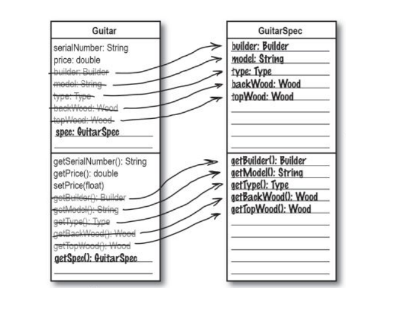
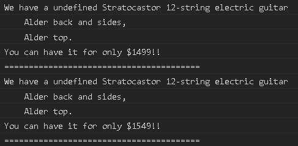

# 1장 (2)

### 캡슐화를 통한 프로그램을 논리적그룹으로 나누기

고객이 Guitar 객체를 제공하는 것은 아니다. 기타를 검색하기 위해서 Guitar 객체 전체를 전달하는 것은 조금 맞지 않는 것이다.  따라서 몇몇 속성들을, 특히 고객이 검색하기 위해 입력되는 그  속성들은 Guitar 객체에서 떼어내어 새로운 객체로 캡슐화를 할 수 있다.

캡슐화는 private 변수로 선언하는 것 뿐만 아니라 프로그램을 논리적 그룹으로 나눠서 분리시키는 일과도 관련이 있다. 클래스 안의 데이터를 프로그램의 행위로부터 분리하는 것처럼 기타의 일반적인 속성을 실제 Guitar객체로부터 분리시킬 수 있다.

Guitar객체가 모든 속성을 가진 새로운 객체타입을 가리키는 변수를 가질수 있게 될 것이다. 즉 Guitar 객체로부터 기타 속성을 캡슐화하여 분리된 객체에 넣는 것이다.


### GuitarSpec 객체 생성



serialNumber와 price는 고유 값이기 때문에 Guitar 클래스에 남아 있는다. 그외 남은 변수 및 관련 메서드를 제외한 모든 변수 및 관련 메서드는 GuitarSpec으로 옮기도록 한다. **중복코드를 볼 때마다 캡슐화할 곳이 있는지를 찾아본다.**

> 캡슐화의 개념은 프로그램 일부의 정보를 다른 부분으로부터 보호하는 것이다. 간단한 형태로 클래스의 데이터를 private로 선언하여 다른 부분으로부터 보호할 수 있다. 하지만 보호해야 할 정보가 속성들일 수도 있지만 행위가 될수도 있다.
>
> 클래스에서 행위를 캡슐화하는 경우, 클래스가 변하지 않고도 행위를 변경할 수 있다. 그래서 저장되는 속성들이 Guitar 클래스로부터 분리되어 캡슐화되어 있기 때문에 Guitar 클래스를 변경할 필요가 없다.
>
> 이것이 캡슐화의 장점이다. 프로그램을 쪼개내어 다른 부분의 수정 없이 특정 부분을 변경할 수 있다. 일반적으로 프로그램 중에 변화 가능성이 높은 부분을 그렇지 않은 부분으로부터 분리하여 캡슐화하게 된다.

  

### 코드 구현

```javascript
class GuitarSpec {
  constructor(builder, model, type, backWood, topWood) {
    this._builder = builder;
    this._model = model;
    this._type = type;
    this._backWood = backWood;
    this._topWood = topWood;      
  }
  getBuilder() { return this._builder; }
  getModel() { return this._model; }
  getType() { return this._type; }
  getBackWood() { return this._backWood; }
  getTopWood() { return this._topWood; }
}

class Guitar {
  constructor(serialNumber, price, builder, model, type, backWood, topWood) {
    this._serialNumber = serialNumber;
    this._price = price;
    this._guitarSpec = new GuitarSpec(builder, model, type, backWood, topWood);
  }
  getSerialNumber() { return this._serialNumber; }
  getPrice() { return this._price; }
  setPrice(price) { this._price = price; }
  getGuitarSpec() { return this._guitarSpec; }
}
```
```javascript
class Inventory {
  constructor() {
    this.guitars = new LinkedList();
  }
  addGuitar(serialNumber, price, builder, model, type, backWood, topWood) {
    const guitar = new Guitar(serialNumber, price, builder, model, type, backWood, topWood);
    this.guitars.add(guitar);
  }
  getGuitar(serialNumber) {
    const k = this.guitars.iterator();
    for(let i = k.next(); !i.done; i = k.next()) {
      if(i.value.getSerialNumber() === serialNumber) {
        return i.value;
      }
    }
    return null;
  }
  search(searchSpec) {
    // 고객이 찾을 정보는 GuitarSpec 객체에 존재한다.
    if(!(searchSpec instanceof GuitarSpec)) 
      throw "searchSpec은 GuitarSpec 클래스여야 합니다.";
    
    const matchingBuitars = [],
          k = this.guitars.iterator();
    
    for(let i = k.next().value; i; i = k.next().value) {
      const spec = i.getGuitarSpec();  // 기타 비교에 사용되는 정보는 GuitarSpec에 있다.
      
      if( searchSpec.getBuilder() !== spec.getBuilder() ) continue;
      if( searchSpec.getType() !== spec.getType() ) continue;  
      if( searchSpec.getBackWood() !== spec.getBackWood() ) continue;
      if( searchSpec.getTopWood() !== spec.getTopWood() ) continue;  
    
      // 대소문자를 걱정해야 하는 속성은 모델명 뿐이다.
      let model = searchSpec.getModel().toLowerCase();
      if( (model !== null) && (model !== spec.getModel().toLowerCase()) ) continue;
    
      matchingBuitars.push(i);
    }  
    return matchingBuitars;
  }
}
```


### 테스트 

```javascript
var guitars = new Inventory();

guitars.addGuitar("V95693", 1499, "Fender", "Stratocastor", "electric", "Alder", "Alder");
guitars.addGuitar("V95", 1499, Builder.FENDER, "Stratocastor", Type.ELECTRIC, Wood.ALDER, Wood.ALDER);
guitars.addGuitar("V91", 1549, Builder.FENDER, "Stratocastor", Type.ELECTRIC, Wood.ALDER, Wood.ALDER);

const whatLikes = new GuitarSpec(Builder.FENDER, "Stratocastor", Type.ELECTRIC, Wood.ALDER, Wood.ALDER);

const matchingGuitars = guitars.search(whatLikes);
matchingGuitars.forEach(o=>{
  let s = o.getGuitarSpec();
  console.log(`We have a ${s.getBuilder()} ${s.getModel()} ${s.getType()} guitar`);
  console.log(`\t${s.getBackWood()} back and sides,`);
  console.log(`\t${s.getTopWood()} top.`);
  console.log(`You can have it for only $${o.getPrice()}!!\n`);
  console.log('====='.repeat(8));
})
```

테스트를 실행하기 위한 전체 코드는 [[여기]](https://gist.github.com/abhbtbb/dfa010b733b49664467576def853ae25) 를 참조할 것. 위의 코드만 복사해서 실행하면 실행이 안됨.


### 누가 무엇을 할까요?

- 유연성  :  계속해서 새로 고치지 않으면서도 소프트웨어가 변하고 성장할 수 있도록 만들 때 유연성을 사용한다. 유연성은 프로그램을 견고하게 만든다.
- 캡슐화  : 변화하는 부분을 변화하지 않는 부분으로부터 분리할 때 캡슐화를 사용한다. 그렇게 하면 다른 부분을 고치지 않고 코드를 수정하는 것이 쉬워진다.
- 기능 : 기능이 없으면 고객을 만족시킬 수 없다. 아무리 프로그램이 잘 설계되어도, 기능이 있어야 만족시킬수 있다.
- 디자인 패턴 : 디자인 패턴은 재사용과 관련있고, 다른 사람이 이미 해결한 문제를 또 다른 사람이 재해결하지 않도록 막는다. 


### 질문과 답

Q. 캡슐화가 이 단계에서 사용할 수 있는 유일한 객체지향원리 인가?  
A. 아니다. 이 단계에서생각할 수 있는 다른 원리로는 상속과 다형성이 있다. 이 두원리 다 중복 코드와 캡슐화와 관련이 있다. 그래서 디자인 개선을 위해 어디에 캡슐화를 사용할 수 잇는지 찾는것 부터 시작하는게 좋다.

Q. 캡슐화가 어떻게 코드를 더 유연하게 만드는것인가?  
A. 소프트웨어가 의도된 대로 동작하게 만들고 나면, 유연성이 중요 사안이 된다.고객이 새로운 속성이나 특징을 추가하고 싶어한다면 어떻게 할까? 중복 코드가 많거나 상속 구조가 혼란스러우면, 수정하기가 힘들어진다. 

> 코드에 캡슐화 같은 원리와 좋은 클래스 설계를 사용하면 이러한 수정이 더 쉽고, 프로그램이 더 유연해진다.


## 프로그래밍 3단계

**설계 한 번하고, 설계 두번하고**

고객이 원하는 기능을 구현하고 객체지향 원리를 적용하였고, 이제제 다른 관점에서 프로그램을 수정할 준비가 되었다. 이번에는 유연하면서도 쉽게 재사용 및 확장이 가능한 프로그램이 되도록 할 것이다.


### Inventory클래스가 정말로 잘 설계되었는가?

검색 도구의 설계를 개선하기 위해 캡슐화를 사용하였지만 여전히 제거할 문제점이 있다. 이 문제점을 해결하면 검색 도구에 새로운 기능이 추가를 원할 때 쉽게 확장할 수 있을 것이며 프로그램의 일부를 재사용하기 쉬워질 것이다. 이 코드를 어떻게 바꿀 것인가?

```javascript
// 바꿀 점이 무엇인가?
search(searchSpec) {
  if(!(searchSpec instanceof GuitarSpec)) 
    throw "searchSpec은 GuitarSpec 클래스여야 합니다.";

  const matchingBuitars = [],
        k = this.guitars.iterator();

  for(let i = k.next().value; i; i = k.next().value) {
    const spec = i.getGuitarSpec();  

    if( searchSpec.getBuilder() !== spec.getBuilder() ) continue;
    if( searchSpec.getType() !== spec.getType() ) continue;  
    if( searchSpec.getBackWood() !== spec.getBackWood() ) continue;
    if( searchSpec.getTopWood() !== spec.getTopWood() ) continue;  

    let model = searchSpec.getModel().toLowerCase();
    if( (model !== null) && (model !== spec.getModel().toLowerCase()) ) continue;

    matchingBuitars.push(i);
  }  
  return matchingBuitars;
}
```


### 이 프로그램은 잘 설계되어 있는가?

12줄 기타를 지원하기위해서는   
  1 . 기타 줄수를 의미하는 새로운 numString 속성을 어디에 추가할 것인가?   
  2 . numString값을 반환할 새로운 getNumStrings() 메소드는 어디에 추가할 것인가?  
  3 . 고객이 12줄 기타를 검색하기 위해는 어디를 수정해야 하는가?  
  4 . 위의 사항을 반영하기 위해 수정을 할 때 설계상에는 어떤 문제가 있는가?


### 추가시 수정해야하는 부분

- `Guitar 클래스`의 생성자 부분에 numString 인자를 받을수 있게 해야한다.
- `GuitarSpec 클래스`에 numString을 받고 get메소드를 만들어야 한다.
- `Inventory 클래스`의 addGuitar 메소드에서 numString을 추가해 줘야 한다.
- `Inventory 클래스`의 search 메소드에서 numString을 비교하도록 추가줘야 한다.

1개의 속성을 추가하기 위해 4곳에서 수정이 필요하게 되었다. 또한 search 메소드 코드에는 재사용이 쉽지 않는 코드들이 있다. 클래스들끼리 모두 상호의존적이고 하나의 클래스를 사용할 때 다른 클래스들도 사용해야 한다.

이렇게 GuitarSpec에 새로운 속성을 넣으면서도 Guitar와 Inventory 클래스는 수정할 필요가 없어야 한다. 이것을 해결하기 위해서는 기타의 명세를 **캡슐화**하여 릭의 기타 검색 도구로부터 **분리할 필요**가 있다.


### 디자인 퍼즐

**문제점**    
GuitarSpec 클래스에 새로운 속성을 추가하면 Guitar 클래스와 Inventory 클래스의 코드를 수정해야 한다. GuitarSpec 에 새로운 속성을 추가해도 그 외의 부분에는 영향을 끼치지 않도록 프로그램의 구조를 재구성해야 한다.

**해야할 일**  
1 . GuitarSpec 클래스에 numString 속성과 getNumString() 메소드를 추가한다.  
2 . Guitar 클래스를 수정하여 GuitarSpec 속성을 생성자로부터 캡슐화하여 분리하다.  
3 . Inventory 클래스의 search 메소드를 수정하여 GuitarSpec ㅋㄹ래스에게 두개의 GuitarSpec 객체를 비교하도록 위임한다.  
4 . 테스트를 진행하여 내용이 잘 동작하는지 확인한다.


### 질문

**Q. GuitarSpec 클래스에 비교하는 것을 위임해야 한다고 했는데 위임이 무엇인가?**  
A. 위임은 객체가 어떤 일을 할 때 직접 하지 않고 다른 객체가 그 일 또는 일의 한 부분을 하도록 하는 것을 말한다.   
즉, Inventory의 search 메소드가 메소드 내에서 직접 두개의 GuitarSpec 객체를 비교하는 대신에 GuitarSpec에게 두 명세가 같은지를 비교하라고 하는 것이다. Search 메소드는 비교하는 것을 GuitarSpec에게 위임한 것이다.

**Q. 왜 그렇게 하는것인가?**  
A. 위임을 하면 코드의 재사용성이 좋아진다. 각 객체가 자기자신의 기능만 하면되고, 한 객체의 기능을 여러 곳에 분산할 필요가 없다.  
자바에서 가장 일반적인 위임의 예를 equals 메소드이다. 메소드가 두개의 객체가 같은지를 직접알아보는 것이 아니라, 두개의 객체중 하나에게 나머지 객체를 매개 변수로 equals 메소드를 호출하여 두개의 객체가 같은지를 비교한다. 

**Q. 위임과 코드의 재사용성의 관계는 무엇인가?**  
A. 위임은 각 객체가 동일성을 스스로 해결하게 한다. 객체가 서로 독립적이고 더 느슨하게 결합되어 있는 것을 의미한다. 느슨하게 결합된 객체는 다른 객체들의 코드와 단단하게 결합되어 있지 않기 때문에 하나의 프로그램에서 빼내어 다른 프로그램에서 재사용하는 것이 쉽다.

**Q. 느슨하게 결합되었다는 것은 무엇을 의미하는가?**  
A. 느슨하게 결합되어 있다는 것은 프로그램의 객체들이 특정한 일을 해야 하면 오직 그일만을 한다는 것을 의미한다. 그래서 프로그램의 기능이 잘 설계된 많은 개게들에 퍼져 있다. 그 객체들은 하나의 일만 할 것이다.

**Q. 그것이 왜 좋은 것인가?**  
A. 느슨하게 결합된 프로그램은 대개 더 유연하고 수정하기 쉽다. 각 객체가 매우 독립적이어서, 한 객체의 기능을 수정할 때 다른 객체는 수정할 필요가 없다. 그래서 새로운 특성이나 기능을 추가하는 것이 훨씬 쉽다.

> 위임 : 한 객체가 기능을 다른 객체에게 넘겨주어 첫 번째 객체를 대신해서 수행하도록 하는 행위


### 디자인 퍼즐 해결

1 . GuitarSpec 클래스에 numString 속성과 getNumString() 메소드를 추가한다.  

```javascript
class GuitarSpec { // 생성자인자 추가
  constructor(builder, model, type, backWood, topWood, numStrings) {
    this._builder = builder;
    this._model = model;
    this._type = type;
    this._backWood = backWood;
    this._topWood = topWood;
    this._numStrings = numStrings;  // 추가
  }
  getBuilder() { return this._builder; }
  getModel() { return this._model; }
  getType() { return this._type; }
  getBackWood() { return this._backWood; }
  getTopWood() { return this._topWood; }
  getNumString() { return this._numStrings; }  // 추가
  match(searchSpec) {  // match 메소드 추가
    if( searchSpec.getBuilder() !== this._builder ) return false;
    if( searchSpec.getType() !== this._type ) return false;
    if( searchSpec.getBackWood() !== this._backWood ) return false;
    if( searchSpec.getTopWood() !== this._topWood ) return false;
    
    let model = searchSpec.getModel().toLowerCase();
    if( (model !== null) && (model !== this._model.toLowerCase()) ) return false;
    return true;
  }
}
```


2 . Guitar 클래스를 수정하여 GuitarSpec 속성을 생성자로부터 캡슐화하여 분리하다.  

```javascript
class Guitar {
  // 생성자 인자 수정
  constructor(serialNumber, price, guitarSpec) {
    if(!(guitarSpec instanceof GuitarSpec))
      throw "guitarSpec은 GuitarSpec Class 이어야 합니다.";  // 추가
    
    this._serialNumber = serialNumber;
    this._price = price;
    this._guitarSpec = guitarSpec;  // 수정
  }
  getSerialNumber() { return this._serialNumber; }
  getPrice() { return this._price; }
  setPrice(price) { this._price = price; }
  getGuitarSpec() { return this._guitarSpec; }
}
```


3 . Inventory 클래스의 search 메소드를 수정하여 GuitarSpec 클래스에게 두개의 GuitarSpec 객체를 비교하도록 위임한다.  

```javascript
class Inventory {
  constructor() {
    this.guitars = new LinkedList();
  }
  // addGuitar에서 파라미터 numStrings 추가
  addGuitar(serialNumber, price, builder, model, type, backWood, topWood, numStrings) {
    // guitarSpec 객체 생성 및 guitar에 인자로 입력
    const guitarSpec = new GuitarSpec(builder, model, type, backWood, topWood, numStrings);
    const guitar = new Guitar(serialNumber, price, guitarSpec);
    this.guitars.add(guitar);
  }
  getGuitar(serialNumber) {
    const k = this.guitars.iterator();
    for(let i = k.next(); !i.done; i = k.next()) {
      if(i.value.getSerialNumber() === serialNumber) {
        return i.value;
      }
    }
    return null;
  }
  search(searchSpec) {
    if(!(searchSpec instanceof GuitarSpec)) 
      throw "searchSpec은 GuitarSpec 클래스여야 합니다.";
    
    const matchingBuitars = [],
          k = this.guitars.iterator();
    
    for(let i = k.next().value; i; i = k.next().value) {
      // GuitarSpec 의 match 메소드에 검사를 위임하고 그 결과를 리스트에 넣는다.
      if(i.getGuitarSpec().match(searchSpec)) matchingBuitars.push(i);
    }  
    return matchingBuitars;
  }
}
```


4 . 테스트를 진행하여 내용이 잘 동작하는지 확인한다.

[테스트를 위한 전체 코드](https://gist.github.com/abhbtbb/049c9d27446bb3b48d668d4718e4ea0c) : 테스트 결과 -> 제대로 동작함.




### 재수정

책에는 위와같은 방식으로 수정을 하고 마무리를 한다. 하지만 위와 같이 할 경우에는 GuitarSpec에 스펙이 추가될 때마다 GuitarSpec의 match와 Inventory의 addGuitar 인자부분을 다 수정해야 한다. 이것을 좀더 번거롭지 않게자바스크립트 문법을 활용해서 다시 고치면 아래와 같이 수정된다. [[전체코드 참고]](https://gist.github.com/abhbtbb/d7a886b235f07e18808af009fb494378)

```javascript
class GuitarSpec {
  constructor(builder, model, type, backWood, topWood, numStrings) {
    this._builder = builder;
    this._model = model;
    this._type = type;
    this._backWood = backWood;
    this._topWood = topWood;
    this._numStrings = numStrings;
  }
  // getter로 전부 수정
  get builder() { return this._builder; }
  get model() { return this._model; }
  get type() { return this._type; }
  get backWood() { return this._backWood; }
  get topWood() { return this._topWood; }
  get numStrings() { return this._numStrings; }

  // match 메소드 for in 순회로 변경, 스펙이 바뀌어도 수정할 필요가 없다.
  match(searchSpec) {  
    for (let i in this) {
      let prop = i.substr(1);
      if (this[prop] !== searchSpec[prop]) return false;
    }
    return true;
  }
}


class Guitar {
  // 생성자 인자 순서 수정
  constructor(guitarSpec, serialNumber, price) {
    if (!(guitarSpec instanceof GuitarSpec))
      throw "guitarSpec은 GuitarSpec Class 이어야 합니다.";  // 추가

    this._serialNumber = serialNumber;
    this._price = price;
    this._guitarSpec = guitarSpec;  // 수정
  }
  // getter, setter로 다 수정
  get serialNumber() { return this._serialNumber; }
  get price() { return this._price; }
  set price(price) { this._price = price; }
  get guitarSpec() { return this._guitarSpec; }
}
```

```javascript
class Inventory {
  constructor() {
    this.guitars = new LinkedList();
  }
  // addGuitar([guitar 속성들],[ guitarSpec 속성들]) 이런식으로 두개의 배열로 입력해준다.
  // GuitarSpec이 변화해도 인자를 추가할 필요가 없다.
  addGuitar(guitarArr, specArr) {
    const guitarSpec = new GuitarSpec(...specArr),
          guitar = new Guitar(guitarSpec, ...guitarArr);
          
    this.guitars.add(guitar);
  }
  getGuitar(serialNumber) {
    for (let i of this.guitars.iterator()) {
      if (i.serialNumber === serialNumber) return i;
    }
    return null;
  }
  // for of으로 순회한다.
  search(searchSpec) {
    if (!(searchSpec instanceof GuitarSpec))
      throw "searchSpec은 GuitarSpec 클래스여야 합니다.";
    
    const matchinguitars = [];
    for (let i of this.guitars.iterator()) {
      if (i.guitarSpec.match(searchSpec)) matchinguitars.push(i);
    }
    return matchinguitars;
  }
}
```


## 우리가 한 일 (프로그래밍 3단계)

1. 여러분의 소프트웨어가 고객이 원하는 기능을 하도록 한다.
  - 검색 도구에서 기능상의 문제를 고치는 것부터 출발했다.
  - 검색 도구가 기타들의 리스트를 반환하도록 기능을 추가했다.

2. 객체지향의 기본 원리를 적용해서 소프트웨어를 유연하게 만든다.
  - 기능을 추가하면서 설계를 견고하게 했다.
  - 기타의 속성을 캡슐화하여 분리하였고, 프로그램에 새로운 속성이 쉽게 추가될 수 있게 하였다.

3. 유지보수와 재사용이 쉬운 디자인을 위해 노력한다.
  - 위임을 사용하여 객체들의 의존성을 낮추어서 재사용이 쉽게 했다.


## 핵심 정리

- 깨지기 쉬운 프로그램은 조금만 잘못 조작해도 문제가 생긴다.
- 캡슐화와 위임 같은 객체지향 원리를 사용하여 유연한 프로그램을 만들수 있다.
- 캡슐화는 프로그램을 여러 개의 논리적부분으로 나눈다.
- 위임은 특정한 일을 해결하는 책임을 다른 객체에게 주는 것이다.
- 프로젝트는 항상 고객이 원하는 것을 알아내는 것부터 시작하라.
- 프로그램의 기본 기능을 구현한 후에 설계를 유연하게 가다듬는다.
- 기능과 유연한 설계가 완성이 되면 디자인 패턴을 사용해서 프로그램의 디자인을 개선하고, 재사용이 용이하게 만든다.
- 프로그램 중 자주 변경을 요하는 부분을 찾아서 변경되지 않는 부분과 분리해 놓는다.
- 잘 동작하지만 설계가 엉망인 프로그램의 경우에 고객은 만족시키지만 문제를 고치느라고 굉장한 고통을 겪을 가능성이 크다.
- OOA&D (객체지향 분석과 설계)는 고객과 프로그래머를 모두 만족시키는 좋은 설계를 갖춘 프로그램을 만드는 방법을 제공한다.

